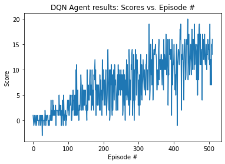
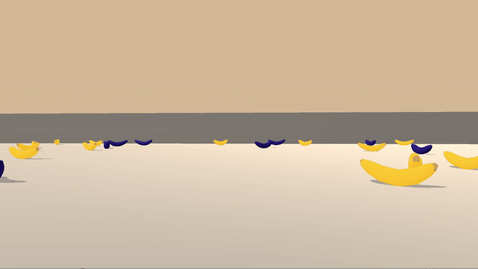
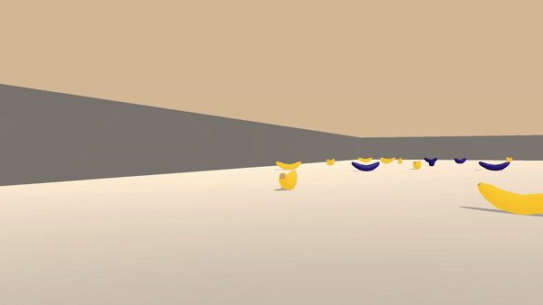

# Report

This report is intended to describe the following points in greater detail than the README.md does:
1.  Theoretical DQN Agent Design
    1.  Q-Learning
    1.  Deep Learning
    1.  DQN-Algorithm
2.  Empirical Results:
3.  Implementation
    3.  Neural Network Architecture
    3.  Hyperparameters
4.  Ideas for Future Improvements
    4.  Double-DQN
    4.  Prioritised Experience replay
    4.  Duel-DQN
    4.  Rainbow

## Theoretical DQN Agent Design

The algorithm used is based on the DQN algorithm described in this paper by Deepmind back in 2015: 
https://storage.googleapis.com/deepmind-media/dqn/DQNNaturePaper.pdf

DQN (Deep-Q-Networks) is an innovative approach in reinforcement learning that effectively combines two separate fields:

### Q-Learning

In classical reinforcement learning, the goal is to have an agent learn how to navigate a new environment with the goal of maximising cumulative rewards. One approach to this end is Q-learning, where the agent tries to learn the dynamics of the environment by assigning values to <state, action>-pairs for the environment under test. This is achieved over the course of training, using it's experiences to produce and improve these estimates: As the agent encounters <state, action>-pairs more often, it becomes more and more "confident" of their value. In the end, an optimal policy can be obtained iteratively by starting from any state and always choosing that action that maximises the <state, action>-value for that state. 

### Deep Learning

Deep Learning is a part of a broader family of machine learning methods and is based upon artificial neural networks. The latter have frequently been used to obtain or even surpass human level performance. They lend themselves to solve tasks in a supervised, unsupervised or semi-supervised manner and solve them completely autonomously, provided a sufficient amount of data is available to train them. In DQN, the Q-tables known from classical Q-learning are substituted with neural networks in order to have them learn the values of <state, action>-pairs directly. Moreover, they are trained with an agent's experiences it has collected during its exploration of the environment. These experiences serve as a reusable form of training data. 

### DQN-Algorithm:
**The DQN-algorithm itself is composed of several components:**

#### Environment Navigation
The Q network is designed to map states to <state, action>-values. Thus we can feed it our current state and then determine the best action as the one that has the largest estimated state-action value. In practice we then adopt an epsilon-greedy approach for actually selecting an action (epsilon-greedy means selecting a random action epsilon of the time in order to encourage early exploration, and selecting the 'best' action 1-epsilon of the time.).

#### Q-network Learning
After we've collected enough experiences (i.e. <state-action-reward-state>-tuples) we start updating the model. This is achieved by sampling some of our experiences and then computing the empirically observed estimates of the <state, action>-values compared to those estimated from the model. The difference between these two is coined the TD-error and we then make a small modification to the model weights to reduce this error, via neural network backpropagation of the TD-error.

#### Iterations
We simply iterate a process involving a combination of the above two procedures over many timesteps per episode, and many episodes, until convergence of the model weights is achieved. Further mathematical details of DQN such as the update equations can be found in the paper mentioned above, and further details of the specifications used for this process can be found in the hyperparameter-section below.

**So far, we simply made use of the vanilla DQN-network.**

A list of more refined versions of the DQN-algorithm can be found in the **"Ideas for Future Improvements"**-section together with brief descriptions.

## Empirical Results

After ~519 episodes the agent was about to 'solve' the environment by attaining an average reward over 100 episodes greater than 13.0.

A plot of score vs episodes is shown below:

A GIF showing the performance of the trained agent:

For comparison, we added another GIF showing the (poor) performance of an untrained agent executing a random action:

## Implementation

### Neural Network Architecture

As described above the architecture uses a vanilla DQN-network.
 
Overall, we chose a standard fully-connected, feed-forward neural network with the following parameters:

1.  Input layer consisting of 37 neurons, representing the 37-dimensional state vector.
2.  Two hidden layers with 32 neurons and ReLU-activation function each.
3.  One single output layer with 4 neurons representing the different actions (action_size = 4) and no (i.e. linear) activation function.

### Hyperparameters

Here, we would like to discuss the hyperparameters occurring in the DQN-algorithm:

**n_episodes (int): maximum number of training episodes**\
the model was found to converge after ~1000 episodes.

**max_t (int): maximum number of timesteps per episode**\
this is useful for environments that permit infinite exploration as it helps reset the environment.

**eps_start (float): starting value of epsilon, for epsilon-greedy action selection**\
to encourage early exploration of the state-action space we're using an epsilon-greedy approach with epsilon starting at 1.

**eps_end (float): minimum value of epsilon**\
Epsilon should never reach 0 or else in the limit we might not explore all state-action pairs, so this sets a lower bound at 0.01

**eps_decay (float): multiplicative factor (per episode) for decreasing epsilon**\
we want epsilon to decay over the course of training as the agent transitions from exploration to exploitation. This was set to 0.995.

**GAMMA (float): discount rate**\
Close to 1 will cause the agent to value all future rewards equally, while close to 0 will cause the agent to prioritise more immediate rewards. Unlike most hyperparameters, this will not only effect convergence but also the optimal policy converged to. For example, if an agent must choose between collecting 1 banana and then waiting 20 timeseteps versus collecting 2 bananas after 20 timesteps, then the optimal policy depends on the reward discount rate. Close to 1 is often best, so we chose 0.99.

**LR (float): model hyperparameter - learning rate**\
This determines how large the model weight updates are after each learning step. If chosen too large a value, then the learning is likely to become unstable, while chosen too small a value, the model may never converge. Therefore, we chose LR to be 5e-4, which is a more or less common choice in Deep Learning.

**BATCH_SIZE (int): model hyperparameter - number of experiences sampled for a model minibatch**\
Too low will cause learning instability and poor convergence, too high can cause convergence to local optima. We chose 64 as a default.

**BUFFER_SIZE (int): replay buffer size**\
this is the size of the experience buffer, which when exceeded will drop old experiences. This is mainly limited by your available RAM - if you experience issues with RAM try lowering it

**TAU (float): how closely the target-network should track the current network**\
After every learning step the target-network weights are updated closer to the current network, so that the target-network weights are a moving average over time of the current network past weights. We chose a relatively small value (1e-3) although haven't experimented with tuning it.

**UPDATE_EVERY (int): how often to update the network**\
How many steps should pass before an update of the current network takes place. We chose every 4 timesteps.

## Ideas for Future Improvements

The following list of modifications and refined approaches may render themselves beneficial for obtaining even better performance than obtained with the DQN-algorithm implemented here:**

### Double-DQN

Note that when updating our Q-values we assume the agent selects the action with the maximum estimated value in the next timestep. However, since these <action, value>-estimates are likely to be noisy, taking the max is likely to overestimate their true value. One small trick that reduces this problem a little bit is to use a model for selecting an action and another model to evaluate that action's value.

Read more: https://arxiv.org/abs/1509.06461

### Prioritised Experience replay

In order to produce training data we store all <state, action, reward, state>-tuples as experiences and then sample them randomly each time we update the model. Note though that some of these may be more valuable for learning that others. For example an agent may have plenty of experiences from the starting state but relatively little from more rare states. In this modification we use how 'surprising' an observed <state, action>-value is as a measure of how 'useful' learning from it is. Formally, this usefuleness can be modeled by the absolute difference between the value we observed for it and the value our model assigns to it.

Read more: https://arxiv.org/abs/1511.05952

### Duel-DQN

Note that under the <state, action, reward> Q learning paradim each timestep contributes to the learning of only one <state, action>-pair. This is despite the fact that for many states the various action values are likely to be very similar, and learning from one action value ought to be transferred to others, since they all arise from the same state. This motivates the idea of the Duel-DQN. It works by using an architecture that forces the Q-values to be learned as the sum of the state value and the action advantage (which represents how much better one action is over another in a given state). Note, however, that the equation Q_sa = V_s + A_sa has too many degrees of freedom to be learned without restrictions, and so we instead use Q_sa = V_s + (A_sa - max_a(A_sa)), using the fact that an optimal policy will always choose the best action, and thereby using it as a benchmark of having 0 advantage.

Read more: https://arxiv.org/abs/1511.06581

### Rainbow

Additions that might improve the algorithm further are the additional 3 modifications of the Rainbow implementation, which achieves state-of-the-art-performance in DQNs.

**Namely these are:**

1.  Learning from multi-step bootstrap targets -  https://arxiv.org/abs/1602.01783
2.  Distributional DQN - https://arxiv.org/abs/1707.06887
3.  Noisy DQN - https://arxiv.org/abs/1706.10295
